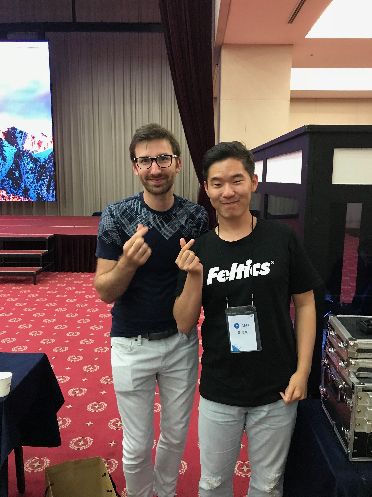

# AMP Roadshow Seoul

## about
### 참가대상
누구에게나 열려있습니다.

### 행사일시
2018년 9월 11일 화요일 09:00–18:00

### 행사장소
서울시 광진구 능동로 209 (군자동) 세종대학교 광개토관 컨벤션센터

## 프로그램
AMP: 아름답고 유연한 사이트를 위한 웹 라이브러리
AMP의 진화된 상호작용
PWA - 프로그레시브 웹 앰프
AMP 사이트 퍼블리싱의 정도正道
AMP의 미래
활용 사례 - SBS, 중앙일보, tyle.io, ADOP

### 후기
구글에서 지원하는 AMP에 대해서 궁금해서 참여를 하게되었습니다.
최근 PWA에 관해서 관심이 많았기에 AMP는 정말 흥미로웠습니다.
하지만, AMP = PWA는 아니지만 서로 같은 역할을 한다는 것이라고 하는 부분이 아직까지 이해는 되지 않네요.
아직 Javascript를 지원하지 않는게 좀 아쉽긴하지만 곧 지원할 예정이라고하니 관심있게 지켜볼 가치가 있을 것 같습니다.